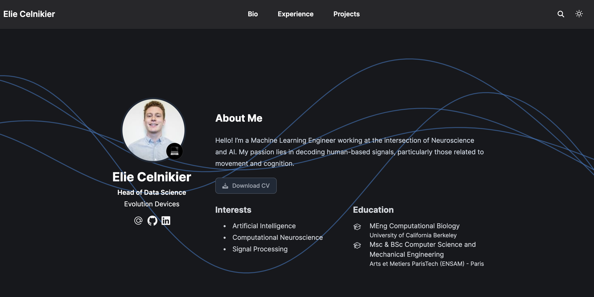

# Elie Celnikier's Personal Website

Welcome to my personal website. Here, I showcase my work as a Machine Learning Engineer and my passion for Neuroscience. (Visit the [site](https://elieclnk.github.io))

## About

This website is built using the Hugo Academic CV Theme. It serves as my online resume, highlighting my publications, projects, and professional experience.

## Features

- **Resume**: An overview of my professional and academic background.
- **Projects**: Details of the projects I have worked on.
- **Blog**: Articles and updates on my work and interests.

## Get in Touch

Feel free to reach out via [email](mailto:elie.celnikier@gmail.com) or connect with me on [LinkedIn](https://www.linkedin.com/in/eliecelnikier).

Visit the site: [elieclnk.github.io](https://elieclnk.github.io)

---
Built with [Hugo](https://gohugo.io/) and the [Hugo Academic CV Theme](https://github.com/HugoBlox/theme-academic-cv).
